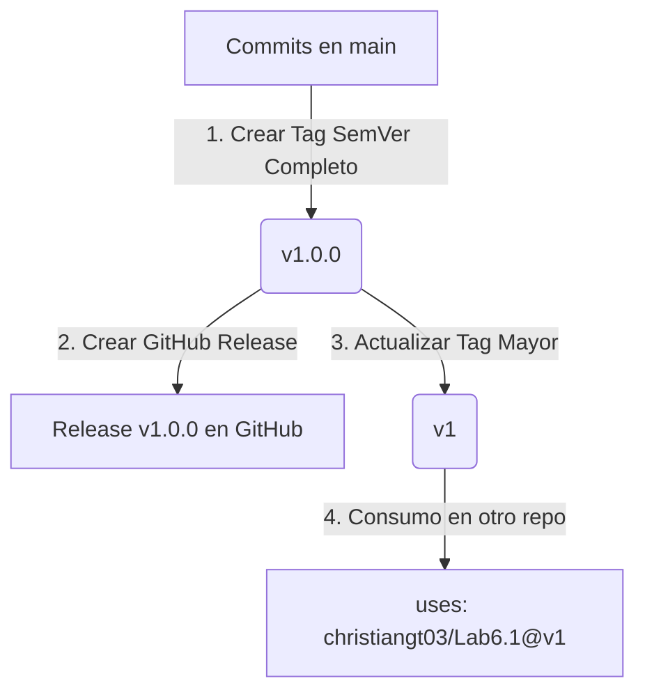

# Informe Técnico — Laboratorio 6: Desarrollo de una Custom Action

Este documento constituye el informe técnico completo para el **Laboratorio 6 — Desarrollo de una Custom Action**, basado en el repositorio de GitHub [christiangt03/Lab6.1](https://github.com/christiangt03/Lab6.1). 

En este laboratorio se ha diseñado, codificado, compilado y estructurado una **GitHub Custom Action en JavaScript** enfocada en la gobernanza de ramas y versionado en flujos de Integración Continua (CI/CD). La acción valida las convenciones de nombres de ramas, sanitiza identificadores y valida y normaliza versiones usando la especificación **Semantic Versioning (SemVer)**.

---

## 📋 Resumen del Proyecto

Para dar cumplimiento a los requerimientos del equipo y maximizar la reutilización de código interno, se desarrolló la acción **Git Branch & Tag Validator**. Esta herramienta automatiza:
1. La validación del formato de ramas en base a prefijos personalizables.
2. La sanitización de nombres de ramas para generar identificadores seguros de sistemas externos (e.g. tags de Docker, nombres de subdominios, slugs de URLs).
3. La extracción e inspección rigurosa de versiones basadas en el estándar SemVer 2.0.0.
4. La gestión robusta ante valores nulos o inputs corruptos.

A continuación se detalla la implementación y resolución de cada una de las partes de la guía de laboratorio.

---

## 🏛️ Parte 1 — Action Metadata (`action.yml`)

El archivo [action.yml](file:///c:/Users/chris/Lab4/action.yml) define la interfaz pública de nuestra custom action. Los metadatos permiten a GitHub Actions interpretar los parámetros requeridos, las salidas producidas y el runtime bajo el cual debe ejecutarse la acción.

### Estructura y Parámetros Definidos

```yaml
name: 'Git Branch & Tag Validator'
description: 'Validates Git branch naming conventions, generates safe slugs, parses SemVer versions, and structures outputs.'
author: 'christiangt03'
branding:
  icon: 'git-branch'
  color: 'purple'
...
```

### 1. Inputs (Entradas parametrizables)
Para evitar el hardcodeo de valores (Restricción 1), se parametrizó completamente el comportamiento de la acción:
- **`branch-name`**: Nombre de la rama o etiqueta a procesar. Es opcional; si no se suministra, el backend de la acción la autodetecta del entorno.
- **`allowed-prefixes`**: Lista de prefijos válidos separados por comas. Por defecto: `feat/,fix/,bugfix/,chore/,docs/,refactor/,release/,hotfix/`. Permite adaptar la acción a cualquier convención de Git Flow o Trunk Based Development.
- **`version-prefix`**: Prefijo de las versiones (por defecto `v`), permitiendo procesar tanto `v1.0.0` como `1.0.0`.
- **`fail-on-error`**: Booleano (`true`/`false`) que determina el comportamiento si el nombre es inválido. Si es `true`, interrumpe el pipeline inmediatamente.

### 2. Outputs (Salidas estructuradas y dinámicas)
Genera salidas dinámicas reutilizables en pasos subsiguientes del workflow (Requisito de la Parte 3 y Restricción 2):
- **`is-valid`**: String `"true"` o `"false"` indicando si el nombre es apto.
- **`branch-type`**: Categoría detectada (e.g., `feat`, `fix`, `release`, `mainline` u `unknown`).
- **`safe-slug`**: String sanitizado para usos seguros en infraestructura.
- **`extracted-version`**: La versión SemVer limpia (e.g., `1.4.2-beta.1`), o `N/A` si no procede.
- **`validation-message`**: Detalle en lenguaje humano del resultado de la validación.

### 3. Runs (Runtime de Ejecución)
Declarado bajo **`node20`** (cumpliendo con la dificultad de runtime recomendada y moderna):
```yaml
runs:
  using: 'node20'
  main: 'dist/index.js'
```
*Nota: Se ejecuta sobre `dist/index.js`, el cual es el compilado autocontenido (Zero-Dependencies) generado mediante `@vercel/ncc`.*

---

## ⚙️ Parte 2 — Lógica de la Acción (`index.js`)

La lógica está escrita en JavaScript puro bajo Node.js ([index.js](file:///c:/Users/chris/Lab4/index.js)). Su implementación incluye algoritmos específicos para validar, normalizar y extraer información:

### 1. Normalización y Generación del "Safe Slug"
Para garantizar que el nombre de la rama pueda emplearse directamente en nombres de imágenes de Docker, kubernetes namespaces o URLs, se aplica la siguiente transformación:
```javascript
let safeSlug = branchName
  .toLowerCase()
  .replace(/[^a-z0-9]/g, '-') // Reemplaza todo lo que no sea alfanumérico por guión (-)
  .replace(/-+/g, '-')        // Contrae guiones duplicados ('---' -> '-')
  .replace(/^-|-$/g, '');     // Remueve guiones iniciales o finales
```

### 2. Parseo y Validación de Semantic Versioning (SemVer)
Se implementó una expresión regular basada en el estándar oficial de **SemVer 2.0.0** para extraer y validar versiones de forma estricta. Si la rama es un release (e.g., `release/v2.0.4-rc.1`) o una etiqueta, se procesa la última sección:
```javascript
const semVerRegexStr = `^(?:${escapeRegExp(versionPrefix)})?(0|[1-9]\\d*)\\.(0|[1-9]\\d*)\\.(0|[1-9]\\d*)(?:-((?:0|[1-9]\\d*|\\d*[a-zA-Z-][0-9a-zA-Z-]*)(?:\\.(?:0|[1-9]\\d*|\\d*[a-zA-Z-][0-9a-zA-Z-]*))*))?(?:\\+([0-9a-zA-Z-]+(?:\\.[0-9a-zA-Z-]+)*))?$`;
const semVerRegex = new RegExp(semVerRegexStr);
```
Esta expresión valida y captura los 5 componentes principales de SemVer: **Major**, **Minor**, **Patch**, **Prerelease** y **Build Metadata**, reconstruyendo una cadena limpia y validada en el output `extracted-version`.

---

## 🔄 Parte 3 — Consumo de Outputs desde el Workflow

Los outputs dinámicos generados por la Custom Action son consumidos en cascada por pasos posteriores del workflow del pipeline. Esto se implementó y validó en el workflow de pruebas [test-action.yml](file:///c:/Users/chris/Lab4/.github/workflows/test-action.yml).

### Consumo de Outputs en Yaml
Para invocar la acción y recuperar sus salidas estructuradas, se asigna un identificador (`id`) al paso que ejecuta la acción. Posteriormente, se accede a ellas utilizando el contexto `${{ steps.<id>.outputs.<nombre_del_output> }}`:

```yaml
      # 1. Invocación de la acción
      - name: Run Branch Validator
        id: validator
        uses: ./  # Ruta local en el repositorio de la Custom Action
        with:
          branch-name: 'release/v1.4.2-beta.1'
          allowed-prefixes: 'feat/,fix/,chore/,release/'
          version-prefix: 'v'
          fail-on-error: 'false'

      # 2. Consumo en pasos posteriores
      - name: Deploy Image using Outputs
        run: |
          echo "La rama es válida?: ${{ steps.validator.outputs.is-valid }}"
          echo "Tipo de rama: ${{ steps.validator.outputs.branch-type }}"
          echo "Nombre seguro para Docker: ${{ steps.validator.outputs.safe-slug }}"
          echo "Versión de release limpia: ${{ steps.validator.outputs.extracted-version }}"
```

### Utilidad Práctica
Este flujo permite automatizaciones avanzadas tales como:
- **Despliegues Condicionales**: Ejecutar el despliegue a producción solo si `${{ steps.validator.outputs.branch-type == 'release' }}` y `${{ steps.validator.outputs.is-valid == 'true' }}`.
- **Tagging de Imágenes**: Etiquetar dinámicamente imágenes Docker usando `${{ steps.validator.outputs.safe-slug }}` o `${{ steps.validator.outputs.extracted-version }}`.

---

## 🏷️ Parte 4 — Estrategia de Versionado y Consumo Remoto

El versionado correcto de una GitHub Action es fundamental para la estabilidad de los repositorios consumidores. Se diseñó una estrategia integral basada en buenas prácticas de GitHub:

### 1. Flujo de Publicación de Tags y Releases
La estrategia de versionado se compone de tres niveles complementarios:



1. **Tag SemVer Completo (Parche)**: Cada cambio estable se etiqueta con un tag semántico de tres partes (e.g., `v1.0.0`).
2. **Tag de Versión Mayor (Major Tag)**: Se mantiene un tag dinámico que representa la versión mayor (e.g., `v1`). Este tag se mueve mediante Git para apuntar siempre al último commit de la versión estable `v1.x.x` correspondiente:
   ```bash
   git tag -fa v1 -m "Actualizar versión mayor v1"
   git push origin v1 --force
   ```
3. **GitHub Release**: Se publica una "Release" formal en la interfaz de GitHub basada en el tag `v1.0.0`, documentando el registro de cambios (Changelog).

### 2. Consumo desde Otro Repositorio
Cualquier otro repositorio de la organización o público puede consumir esta Custom Action haciendo referencia al repositorio original de forma remota:

- **Consumo Dinámico (Recomendado)**: Se suscribe a actualizaciones de parches sin romper la retrocompatibilidad.
  ```yaml
  uses: christiangt03/Lab6.1@v1
  ```
- **Consumo Estricto**: Para fijar una versión inmutable e hiper-segura en producción.
  ```yaml
  uses: christiangt03/Lab6.1@v1.0.0
  ```

---

## 🛡️ Parte 5 — Robustez y Gestión de Errores

Para garantizar un funcionamiento fiable ante contingencias en los pipelines, se programaron múltiples mecanismos de seguridad en [index.js](file:///c:/Users/chris/Lab4/index.js):

### 1. Gestión de Inputs Vacíos o Nulos
Si el input `branch-name` es nulo o vacío (espacios en blanco), el script no crasheará. En su lugar, aplica una estrategia de recuperación progresiva (Fallback):
- Primero intenta recuperar `process.env.GITHUB_REF_NAME` (la rama corta proporcionada por el runner de GitHub, ej. `feat/auth`).
- Si no está disponible, intenta extraer la rama/etiqueta analizando la variable de entorno `process.env.GITHUB_REF` (removiendo el prefijo `refs/heads/` o `refs/tags/`).
- Si ninguna variable de entorno está presente (ej. ejecución en entorno de pruebas local aislado), el script **captura el error controladamente** y lanza un mensaje descriptivo orientando al desarrollador sobre cómo solucionarlo.

### 2. Control de Fallos con `fail-on-error`
El desarrollador puede desear que un nombre de rama inválido no detenga su compilación o por el contrario, que bloquee inmediatamente el paso del pipeline. Esto se maneja dinámicamente:
- **`fail-on-error: false`** (Por defecto): La acción reporta los fallos de naming en las salidas (`is-valid: false`), pero el workflow continúa ejecutándose.
- **`fail-on-error: true`**: La acción ejecuta `core.setFailed()` interrumpiendo el flujo del CI de GitHub con un código de salida `1` y marcando el paso en rojo con el error preciso.

---

## 📊 Validación de Requisitos y Restricciones

| Requisito / Restricción | Estado | Implementación / Evidencia |
| :--- | :---: | :--- |
| **No Hardcodear valores** | **Cumplido** | Todos los parámetros se obtienen a través de `core.getInput()` con valores por defecto configurables en `action.yml`. |
| **Al menos un output dinámico** | **Cumplido** | La acción genera múltiples outputs dinámicos calculados en tiempo de ejecución: `is-valid`, `safe-slug` y `extracted-version`. |
| **Reutilización en otros repos** | **Cumplido** | La acción se compila con NCC a `dist/index.js`. Al subirse a GitHub, es accesible de forma remota mediante `christiangt03/Lab6.1@v1`. |
| **Manejo del Runtime Node** | **Cumplido** | Declarado bajo `node20` en `action.yml` y empaquetado libre de dependencias nativas para una ejecución veloz en runners de Linux, Windows o macOS. |

---

## 🏁 Conclusión

El Laboratorio 6 demuestra cómo empaquetar lógica empresarial común en una Custom Action de JavaScript. Al desacoplar la lógica de validación de nombres de ramas y normalización de SemVer del archivo YAML de configuración del pipeline, se logra:
- **Reducir la duplicación de código** en múltiples repositorios.
- **Estandarizar las políticas de desarrollo** a nivel organizacional.
- **Facilitar el mantenimiento**, ya que corregir un bug o agregar un nuevo prefijo a la gobernanza se realiza en un único repositorio (`Lab6.1`), actualizándose de forma transparente para los consumidores a través de la etiqueta `@v1`.
